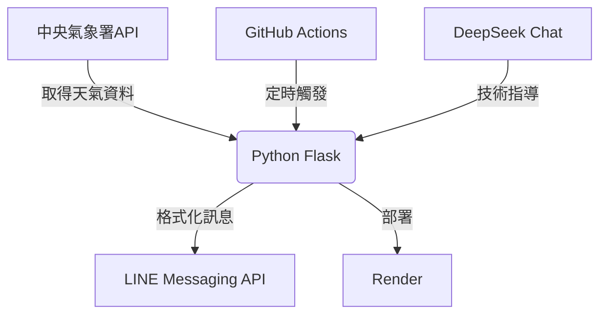

# 🌦️ LINE 天氣預報機器人


## ✨ 功能特色
- **精準天氣預報**：使用中央氣象署官方資料
- **定時自動推送**：每天23:00發送明日天氣
- **美觀格式**：精心設計的訊息排版與Emoji圖示
- **完全免費**：利用免費雲端服務部署
- **AI協作開發**：由 DeepSeek Chat 提供技術指導

## 🛠️ 技術架構


## 🔧 使用技術與服務
| 技術/服務         | 用途                  | 備註                     |
|-------------------|-----------------------|--------------------------|
| Python 3.9+       | 後端程式邏輯          |                          |
| LINE Messaging API| 訊息推送              | 免費每月500則            |
| 中央氣象署API     | 天氣資料來源          | 免信用卡申請             |
| Render            | 免費雲端部署          |                          |
| GitHub Actions    | 定時任務觸發          | 替代Cron Job             |
| DeepSeek Chat     | 開發輔助              | 解決API整合問題          |

## 🧠 AI 協助內容
本專案在以下環節接受 DeepSeek Chat 的技術指導：
- LINE Messaging API 整合與錯誤排查
- 中央氣象署API 資料解析
- Render 部署配置
- GitHub Actions 定時任務設定
- 天氣訊息格式優化

## 🚀 快速部署
```bash
# 克隆倉庫
git clone https://github.com/feifacunzai/LineWeather.git
cd LineWeather

# 設定環境變數 (需自行建立 .env 檔案)
echo "LINE_TOKEN=YOUR_LINE_TOKEN" > .env
echo "CWA_API_KEY=YOUR_CWA_KEY" >> .env
echo "USER_ID=YOUR_USER_ID" >> .env
```

## 📝 使用說明
```
🌤️ 【台北明日天氣預報】
▸ 天氣狀況：晴時多雲
▸ 降雨機率：10%
▸ 溫度範圍：13°C ~ 29°C
▸ 舒適度：寒冷至舒適
──────────────────
⏰ 預報時段：06:00 ~ 18:00
📅 資料來源：中央氣象署
```

## 📜 授權
[MIT License](LICENSE) | **AI 貢獻聲明**：本專案核心邏輯由開發者實現，DeepSeek Chat 提供技術建議與除錯協助。

---

<p align="center">
  
  
  
</p>

<p align="center">
  <em>🤖 人機協作開發範例 | 💡 天氣資訊從此主動報到！</em>
</p>
